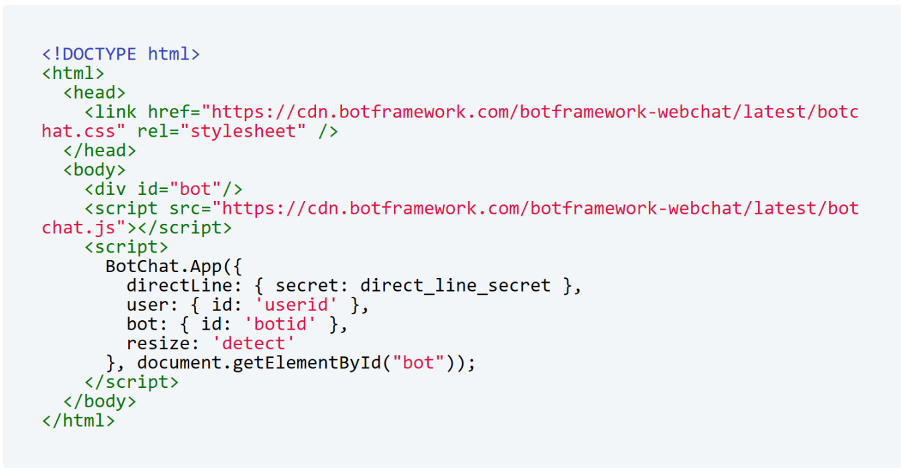
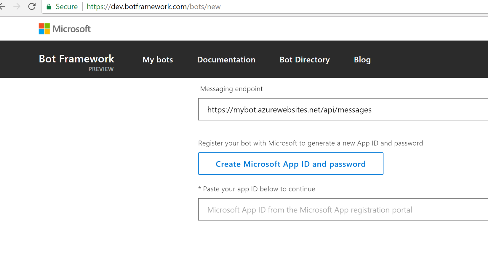
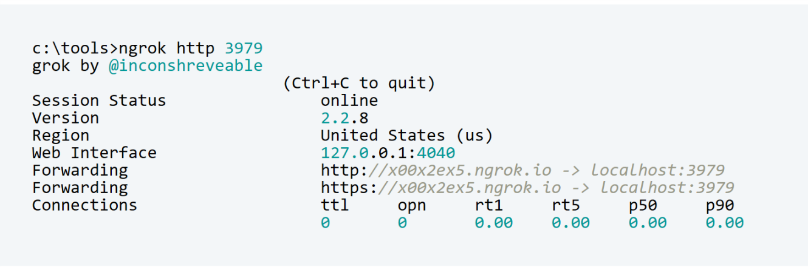
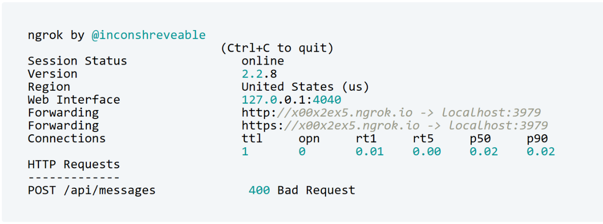

# Debugging your bot connected to the Direct Line API channel
I'm currently working on a prototype of a web chat bot which will be embedded into a website. The easiest way to do it is to embed the iframe of your web chat control into your website. You can find more information on that here.
But what if you want to pass some information to your bot implementation from the hosting web page? Some kind of contextual information might be very useful, and the most interesting scenario is a user-friendly Single-Sign-On (SSO), where the hosting webpage would pass a user name or even a JWT access token to your bot implementation. The bot would trust this authenticated user and use the token for the further requests to the resources also protected by the same token issuer. One example is the Graph API accessing user's Office 365 data.
In this case you would probably move away from the iframe and decide to implement a Direct Line API talking to your bot and using a javascript library representing the webchat control. You can find a nice example for that here 

.

But if you decide to use the Direct Line API channel and debug your bot receiving this contextual information, you would need to define your public messaging endpoint - see below 

.

So, how would you debug your bot running locally? You cannot just put your http://localhost:3979/api/messages in the text box above. It's obvious that you'll need to use a proxy redirecting the requests from a routable host to your localhost:3979.
This article describes how to use ngrok for some testing scenarios involving the Bot Framework Channel Emulator, but what if you want to debug the requests coming from your hosting webpage as described above?
My fist attempt to start using ngrok for that didn't really work immediately:

.

I defined the messaging endpoint as https://xx00x2ex5.ngrok.io/api/messages as described above. But during the tests I was not able to reach my bot implementation receiving the following error message:

.

